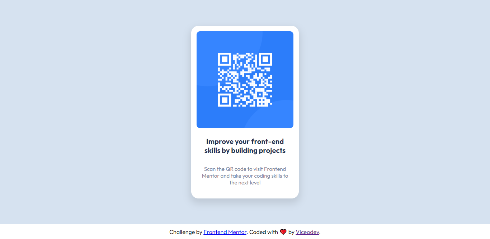

# Frontend Mentor - QR code component solution

This is a solution to the [QR code component challenge on Frontend Mentor](https://www.frontendmentor.io/challenges/qr-code-component-iux_sIO_H). Frontend Mentor challenges help you improve your coding skills by building realistic projects. 

## Table of contents

- [Overview](#overview)
  - [Screenshot](#screenshot)
  - [Links](#links)
- [My process](#my-process)
  - [Built with](#built-with)
  - [What I learned](#what-i-learned)
- [Author](#author)
- [Acknowledgments](#acknowledgments)

**Note: Delete this note and update the table of contents based on what sections you keep.**

## Overview

### Screenshot



### Links

- Solution URL: [Link Here](https://github.com/viceodev/Frontend-Mentor-Solutions/tree/main/qr-code-component-main)
- Live Site URL: [Link Here](https://viceodev.github.io/Frontend-Mentor-Solutions/qr-code-component-main/)

## My process

### Built with

- Semantic HTML5 markup
- CSS custom properties
- Sass (CSS Preprocessor)
- Flexbox
- BEM Naming Methodology
- Mobile-first workflow


#viceodev #viceo #html #webdevelopment #computerprogramming #computerlanguages #internetinfrastructure #writing 
### What I learned
I learned more about Accessiblity from this exercise. I understood the benefits of using Semantic HTML tags for my HTML pages. I also learned the best practises for using HTML5, Landmarks and  ARIA  Roles.

For example, consider the difference in the next two codeblocks

```html
<body>
    <div class="header" >Header Content</div>

    <div class="main">
        <div> Navigational Content</div>
        <div>
            <h1>Section Title</h1>
            <div>Article content that can stand on it's own.</div>
        </div>
    </div>

    <div class="footer">Footer Content</div>
</body>
```

```html
<body>
    <header role="">Header Content</header>

    <main>
        <nav> Navigational Content</nav>
        <section>
            <h1>Section Title</h1>
            <article>Article content that can stand on it's own.</article>
        </section>
    </main>

    <footer>Footer Content</footer>
</body>
```

You can learn more from these resources.

https://laylacodes.hashnode.dev/what-is-semantic-html/

https://www.w3.org/WAI/ARIA/apg/patterns/landmarks/examples/general-principles.html

https://developer.mozilla.org/en-US/docs/Web/HTML/Element#content_sectioning


## Author

- Website - [Victor Okonkwo](https://www.viceodev.tech)
- Frontend Mentor - [@viceodev](https://www.frontendmentor.io/profile/viceodev)
- Twitter - [@viceodev](https://www.twitter.com/viceodev)


## Acknowledgments

Big thanks to [@ecemgo](https://github.com/ecemgo) for his help with understanding how Accessiblity works.
